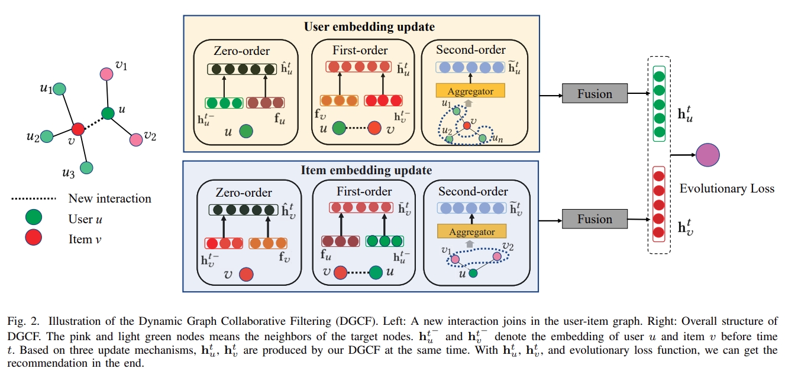

# DGCF



This is the code for the ICDM 2020 Paper: [Dynamic Graph Collaborative Filtering](https://ieeexplore.ieee.org/abstract/document/9338436).

## Usage

Our code mainly mainly refers to jodie: https://github.com/srijankr/jodie/, data download method, running environment and initialization are the same as jodie.

### Train model
To train the DGCF model using the ```data/<network>.csv``` dataset, use the following command. This will save a model for every epoch in the ```saved_models/<network>/``` directory.

```python DGCF.py --network <network> --model DGCF --epochs 50 --method attention  --adj  ```

This code can be given the following command-line arguments:

```--network:``` choose to the train data:```reddit\wikipedia\lastfm```

```--model:``` this is the name of the model  

```--epochs:```  this is the maximum number of interactions to train the model.

```--embedding_dim:``` this is the number of dimensions of the dynamic embedding.

```--method:```  this is the type of aggregator function in second-order aggregation

```--adj:```  this is a boolean input indicating if use the second update.

```--length：``` this is  the aggregator size in second-order aggegator function.

### Evaluate the model

To evaluate the performance of the interaction prediction task in one epoch, use the following command:

```python  evaluate_interaction_prediction.py --network   --model  --method ```

To evaluate the performance of the interaction prediction task in all epoch, user the followinig command:

```python  evaluate_all.py --network  --model --method```

For detailed code execution, you can refer to the command line in the ```./Shell``` folder.


## Requirements

- python3
- jsonlines
- pytorch
- torch-geometric

## Citation

Please cite our paper if you use the code:

```
@inproceedings{li2020dynamic,
  title={Dynamic graph collaborative filtering},
  author={Li, Xiaohan and Zhang, Mengqi and Wu, Shu and Liu, Zheng and Wang, Liang and Philip, S Yu},
  booktitle={2020 IEEE International Conference on Data Mining (ICDM)},
  pages={322--331},
  year={2020},
  organization={IEEE}
}
```
